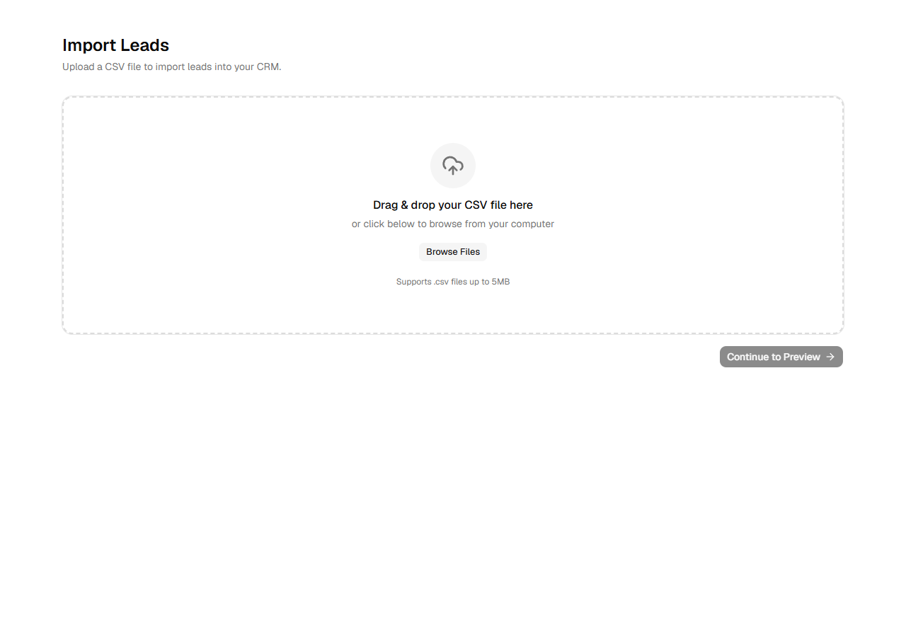
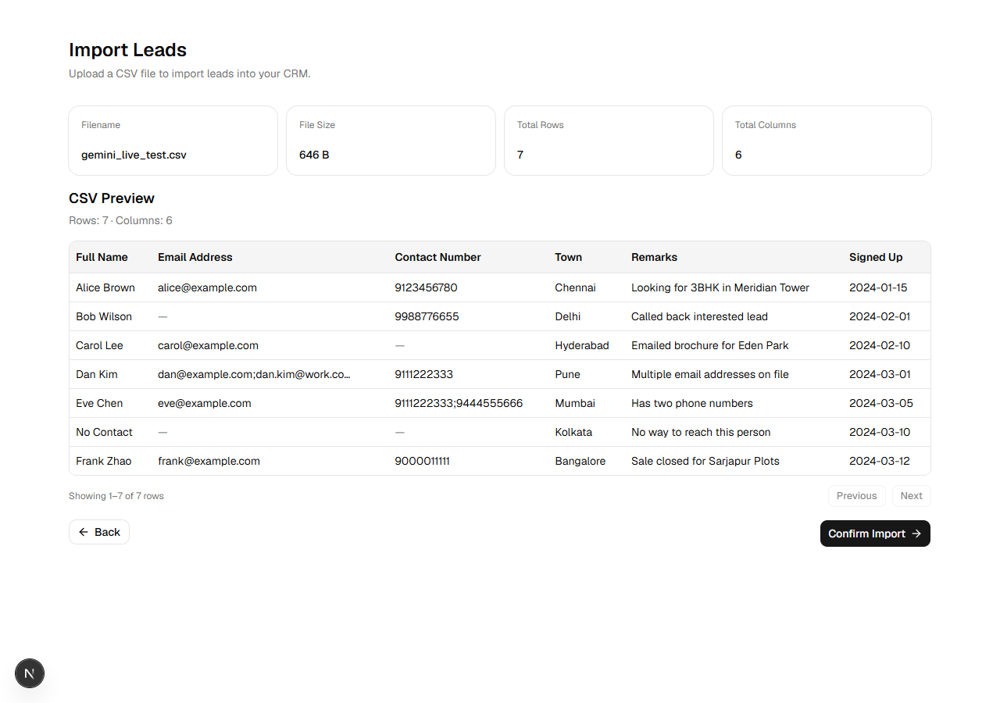
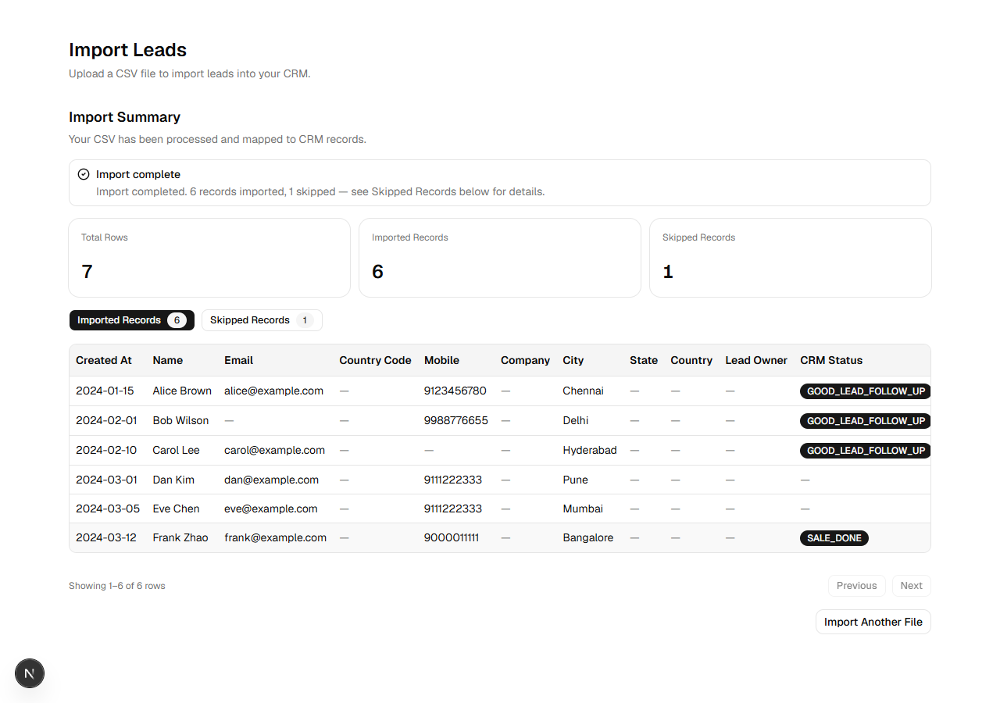
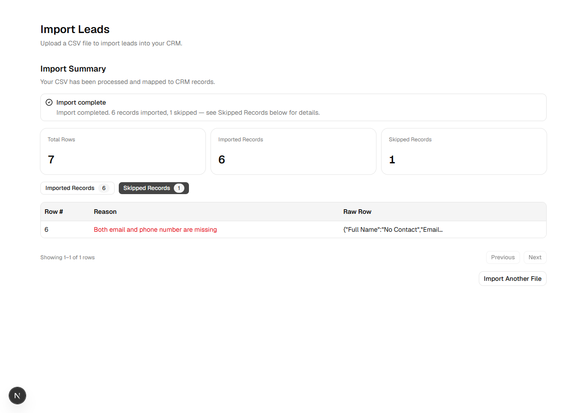

# GrowEasy AI CSV Importer

AI-assisted CSV importer for GrowEasy CRM. Upload a CSV with arbitrary column
names, preview it, confirm, and the backend uses Gemini to map rows onto the
fixed CRM schema.

Two independent apps, no shared tooling, no database, no queue — everything
runs synchronously in a single request/response cycle.

```
frontend/   Next.js 15 + TypeScript + Tailwind + shadcn/ui + TanStack Table
backend/    Express + TypeScript + Multer + PapaParse + Gemini + Zod
```

## Prerequisites

- Node.js 20+
- A Gemini API key: https://aistudio.google.com/apikey

## Installation

### 1. Backend

```bash
cd backend
npm install
cp .env.example .env
# edit .env and set GEMINI_API_KEY
npm run dev
```

Runs on http://localhost:4000. Health check: `GET /api/health`.

### 2. Frontend

```bash
cd frontend
npm install
cp .env.local.example .env.local
npm run dev
```

Runs on http://localhost:3000. Open http://localhost:3000/import to use the app.

## Environment Variables

**backend/.env**

| Variable | Default | Description |
|---|---|---|
| `PORT` | `4000` | API port (Render overrides this automatically in production — don't set it manually there) |
| `CORS_ORIGIN` | `http://localhost:3000,http://localhost:3001` | Comma-separated list of allowed frontend origins. Includes `:3001` because Next.js silently falls back to that port whenever `:3000` is already taken by another dev server — without it, that fallback causes a confusing "could not reach the import server" error that's actually a CORS rejection, not a down backend. In production, set this to just your deployed frontend URL. |
| `GEMINI_API_KEY` | — | Required. Google Gemini API key |
| `GEMINI_MODEL` | `gemini-flash-latest` | Gemini model used for CRM field extraction. Google's alias for its current recommended Flash model — pinned model names like `gemini-2.5-flash` get cut off from new API keys over time, so the alias is what stays working. Override this in `.env` if your key has access to a specific pinned model. |
| `MAX_UPLOAD_SIZE_MB` | `10` | Max CSV upload size |
| `CSV_BATCH_SIZE` | `30` | Rows per batch sent to Gemini |

**frontend/.env.local**

| Variable | Default | Description |
|---|---|---|
| `NEXT_PUBLIC_API_BASE_URL` | `http://localhost:4000` | Backend API base URL |

## Architecture

- **No database.** The uploaded CSV is parsed and processed in memory within
  a single request; results are returned directly to the client. The
  uploaded file itself is deleted from disk as soon as processing finishes
  (success or failure).
- **No queue.** CSV rows are parsed, split into batches, and sent to Gemini
  sequentially inside the request handler. Kept simple since import files
  are expected to be small/medium (assignment scope, not high-volume
  production ingestion). A 150-row / 5-batch CSV completes in ~2 minutes
  against the live API.
- **Thin controller, fat services.** `import.controller.ts` only orchestrates;
  all real logic lives in `csv.service.ts` (parsing/validation),
  `gemini.service.ts` (AI extraction), and `validation.service.ts` (schema
  checking).
- **Resilience, not perfection.** A failed Gemini batch is retried once. If
  it still fails, every row in that batch is marked "skipped" with the
  reason recorded — the import always returns a result, it never crashes or
  loses the rest of the file over one bad batch.

### Request flow

```
Upload (browser)
  -> Preview (client-side, PapaParse — no backend call yet)
  -> Confirm Import
  -> POST /api/imports (multipart/form-data, field "file")
       -> Multer saves to backend/uploads/<uuid>.csv
       -> csv.service.ts parses + validates (headers exist, >=1 row)
       -> rows split into batches of CSV_BATCH_SIZE
       -> for each batch: gemini.service.ts calls Gemini (retried once on failure)
       -> every Gemini record validated against the shared Zod schema
       -> uploaded file deleted (always, even on error)
  -> JSON response { imported, skipped, totalRows }
  -> Results screen: summary stats + TanStack Table (imported / skipped tabs)
```

## AI Flow (Gemini extraction)

For each batch of rows, `gemini.service.ts` sends a prompt that:

1. Includes the full CRM schema (all 15 fields) with instructions to use
   `""` for anything not present in the row — **the model is told never to
   invent values.**
2. Requires the response to be a JSON array with **exactly one element per
   input row, in the same order** — this is what lets the backend map each
   result (or skip) back to its original raw CSV row without any guesswork,
   even when some rows are skipped.
3. Constrains `crm_status` to exactly one of `GOOD_LEAD_FOLLOW_UP`,
   `DID_NOT_CONNECT`, `BAD_LEAD`, `SALE_DONE` (or blank).
4. Constrains `data_source` to exactly one of `leads_on_demand`,
   `meridian_tower`, `eden_park`, `varah_swamy`, `sarjapur_plots` (or blank
   if the source doesn't clearly match — never guessed).
5. Handles multiple emails/phones: the first goes into `email` /
   `mobile_without_country_code`, any extras are appended to `crm_note`.
6. Instructs the model to mark a row as "skip" only when **both** email and
   phone are missing from that row.

The response is parsed as JSON (`responseMimeType: "application/json"`,
`temperature: 0`), and every record — whether Gemini marked it valid or
not — is still re-checked against `crmRecordSchema` (the shared Zod schema)
before it's ever returned to the client. Records that fail either the
skip-reason check or schema validation are moved to `skipped` with the
reason attached; they never crash the import.

**Verified against the live API** (see Testing below): correct field
mapping, multi-email/phone → `crm_note`, skip-only-if-both-missing, exact
enum values for `crm_status`/`data_source`, blank-if-unknown, and no
hallucinated values on fields absent from the source CSV.

## Testing performed

Manually verified end-to-end (browser + live Gemini API):

| Scenario | Result |
|---|---|
| Small CSV (1–3 rows) | Parses, previews, imports correctly |
| Large CSV (150 rows / 5 batches) | All 150 imported, 0 failures, ~2 min |
| Different column names (`Full Name`, `Email Address`, `Contact Number`, `Town`) | Parsed and mapped correctly regardless of header names |
| Missing email | Row imported with `email: ""`, not hallucinated |
| Missing mobile | Row imported with `mobile_without_country_code: ""`, not hallucinated |
| Multiple emails | First → `email`, rest → `crm_note` |
| Multiple phone numbers | First → `mobile_without_country_code`, rest → `crm_note` |
| Invalid row (both email + phone missing) | Correctly skipped with reason `"Both email and phone number are missing"` |
| Empty CSV / header-only CSV / non-CSV upload / no file | All return `400` with a friendly message, no crash |
| Gemini request failure (invalid/missing API key, bad model name) | Batch retried once, then all rows in that batch skipped with reason — import still completes, never crashes |

Also checked: `tsc --noEmit` clean on both apps, `next build` production
build passes (including ESLint), zero browser console errors, zero failed
network requests (checked via automated Playwright run against the real
dev servers).

## Screenshots

**Upload**


**Preview** (client-side CSV parse, before any backend call)


**Results — Imported Records** (real Gemini output — see the CRM Status
badges and the "Import complete" summary banner)


**Results — Skipped Records** (with reason per row)


## Deployment

### Backend → Render

A `render.yaml` Blueprint is included at the repo root.

1. Push this repo to GitHub/GitLab.
2. In Render: **New +** → **Blueprint**, point it at the repo.
3. Render reads `render.yaml` and creates a web service rooted at `backend/`
   (build: `npm install && npm run build`, start: `npm start`, health check:
   `/api/health`).
4. When prompted, set the `sync: false` env vars in the Render dashboard:
   - `GEMINI_API_KEY` — your Gemini API key
   - `CORS_ORIGIN` — your deployed Vercel frontend URL (e.g.
     `https://your-app.vercel.app`)
5. Don't set `PORT` manually — Render injects it automatically and the app
   already reads `process.env.PORT`.

If you'd rather configure it manually instead of via Blueprint: set the Root
Directory to `backend`, Build Command to `npm install && npm run build`,
Start Command to `npm start`, and add the same env vars from the table
above.

### Frontend → Vercel

1. Import the repo in Vercel.
2. Set **Root Directory** to `frontend` in the project settings.
3. Set the environment variable `NEXT_PUBLIC_API_BASE_URL` to your deployed
   Render backend URL (e.g. `https://groweasy-import-api.onrender.com`).
4. Deploy — Vercel auto-detects Next.js, no `vercel.json` needed.

Note: `NEXT_PUBLIC_*` variables are baked in at build time, so redeploy the
frontend if you change the backend URL after the first deploy. Also update
`CORS_ORIGIN` on the backend if the Vercel domain changes (e.g. a new
preview URL).
